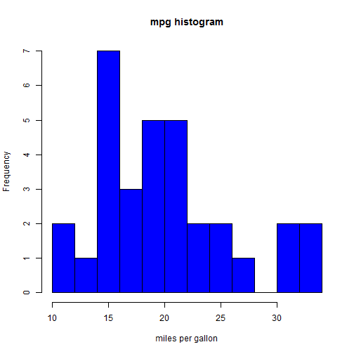

Milage Per Gallon using mtcars Dataset
========================================================
author: Krishan Bhatt
date: 09/06/2016

Overview
========================================================

Some key point covered in below slide deck.

- Deployed App
- Motor Trend Car Road Tests (mtcars) dataset
- Summary of mtcars Dataset
- Some analysis in mtcars


Deployed App
========================================================

### Shiny Application  
- URL: *https://kbhatt.shinyapps.io/PredictMPG/*
- A shiny-App shows the relationship between variables and miles per gallon (MPG).

### Reproducible Pitch Presentation  
- URL: *http://rpubs.com/kbhatt/207171*

### All SourceCode at Github:

```
https://github.com/kdbhatt/Developing-Data-Products/tree/master/PredictMPG
```


Motor Trend Car Road Tests (mtcars) dataset
========================================================

The data was extracted from the 1974 Motor Trend US magazine, and comprises fuel consumption and 10 aspects of automobile design and performance for 32 automobiles (1973-74 models).


```r
head(mtcars, 3)
```

```
               mpg cyl disp  hp drat    wt  qsec vs am gear carb
Mazda RX4     21.0   6  160 110 3.90 2.620 16.46  0  1    4    4
Mazda RX4 Wag 21.0   6  160 110 3.90 2.875 17.02  0  1    4    4
Datsun 710    22.8   4  108  93 3.85 2.320 18.61  1  1    4    1
```

Slide Motor Trend Car Road Tests Summary
========================================================

```r
summary(cars)
```

```
     speed           dist       
 Min.   : 4.0   Min.   :  2.00  
 1st Qu.:12.0   1st Qu.: 26.00  
 Median :15.0   Median : 36.00  
 Mean   :15.4   Mean   : 42.98  
 3rd Qu.:19.0   3rd Qu.: 56.00  
 Max.   :25.0   Max.   :120.00  
```

Miles per Gallon Histogram
========================================================



Conclusion
========================================================

This explains about the Milage Per Gallon using mtcars Dataset.
